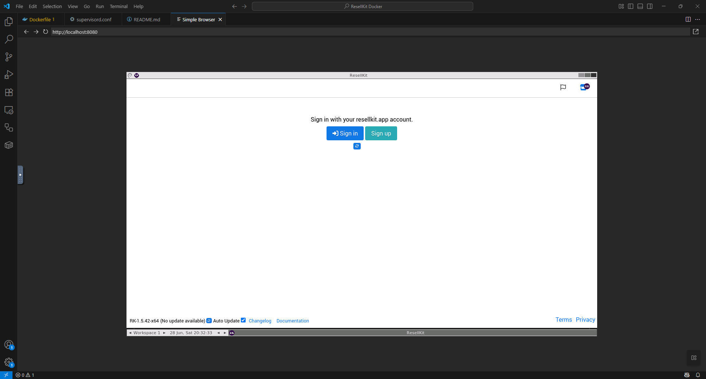

# ResellKit Docker

This Docker image wraps the ResellKit application in a browser-accessible container. **ResellKit Docker** was born out of my frustration with maintaining a full Ubuntu VM just to run a single app. Running a virtual machine just to access ResellKit felt excessive and I wanted a lightweight alternative to hosting ResellKit and which is accessible from any device.

> ⚠️ This project is still in early testing. Please do not rely on it for production use without regular backups.

## Screenshot
This is what it looks like when accessing the webserver after starting the container.
<div style="text-align: center;">
  
</div>

## Quick Start

You can either run with Docker using the provided image or build one yourself.

### Option 1: Run with Docker
To run with Docker:
```
docker run -d -p 8080:8080 queball1999/resellkit-docker
```

To run with Docker Compose:

```
git clone https://github.com/queball1999/ResellKit-Docker
cd ResellKit-Docker
docker-compose up -d
```

Now, navigate to `http://localhost:8080`

### Option 2: Build and Run Locally
If you want to build the image yourself (for development or customization) see [below](#build-and-run-locally).


## Build and Run Locally
Here are the steps you will need to build and run the image locally.

1. **Clone the Repo**

    ```
    git clone https://github.com/queball1999/ResellKit-Docker
    cd ResellKit-Docker
    ```

2. **Download latest AppImage (optional)**

    The repo does not come with the extracted resellkit AppImage, however you can follow the steps below to obtain the latest AppImage and extract its contents.

    **Download AppImage**
    ```
    curl -LO https://resellkit.app/download/ResellKit-x86_64.AppImage
    ```

    **Make AppImage Executable**
    ```
    chmod +x ResellKit-x86_64.AppImage
    ```

    **Extract the AppImage**
    ```
    ./ResellKit-x86_64.AppImage --appimage-extract
    ```

    **Overwrite the existing extracted folder**
    ```
    mv squashfs-root resellkit-extracted
    ```

3. **Build and run**

    ```
    docker build -t resellkit-docker .
    docker run -d -p 8080:8080 resellkit-docker
    ```

Now, navigate to `http://localhost:8080`

## Notice
This project has no affiliation with ResellKit. I am simply a hobbyist who enjoys their product and hopes to make it more accessible.